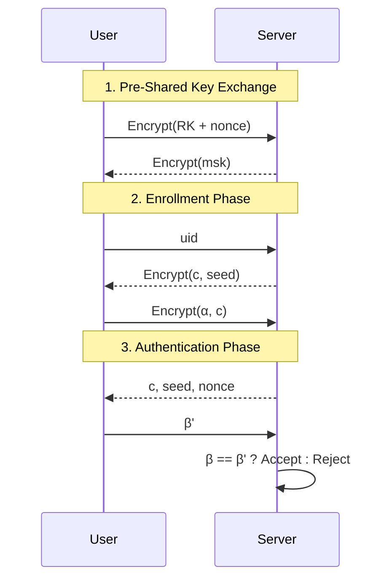

# PUF-Based Adaptive Authentication Protocol for IoT Devices

This project implements a **3-phase, adaptive, and lightweight authentication protocol** leveraging **Physically Unclonable Functions (PUFs)** for secure communication between IoT devices and servers. It is designed especially for scenarios like **remote EV charging stations** where secure, fast, and resource-efficient authentication is needed.

---

## Repository Contents

- `client.py` – Simulates the IoT device/mobile app. It:
  - Communicates with the server for enrollment and authentication
  - Simulates a PUF response for security
- `server.py` – Simulates the backend control station. It:
  - Manages user database, handles enrollment and authentication
  - Detects and mitigates replay/MITM attacks
- `requirements.txt` – Lists Python dependencies

---

## Protocol Flow



---

## Quick Start

### Installation

```bash
# Clone the repo
git clone https://github.com/yourusername/iot-puf-auth.git
cd iot-puf-auth

# Create virtual environment (optional)
python3 -m venv venv
source venv/bin/activate

# Install dependencies
pip install -r requirements.txt
```

### Run Demo

Start server:

```bash
python server.py
```

Start client (in a new terminal):

```bash
python client.py
```

You can test:
- Legal user authentication
- Illegal/attacker scenario
- Adaptive authentication under high threat

---

## Features

- **PUF-based device identity** (no two devices can replicate responses)
- **No encryption in default authentication** → fast and lightweight
- **Adaptive security**: Adds encryption if threat score is high
- **Resilient to replay and MITM attacks**
- **No direct PUF response transmission**

---

## Results (Test Scenarios)

| Scenario | Description | Outcome |
|----------|-------------|---------|
| Legal User | Enrolled device authenticates | Success |
| Illegal User | Not enrolled or incorrect key | Failure |
| High Threat | Adaptive encryption used | Secure |

---

## License

This project is licensed under the MIT License – see the `LICENSE` file for details.

---
